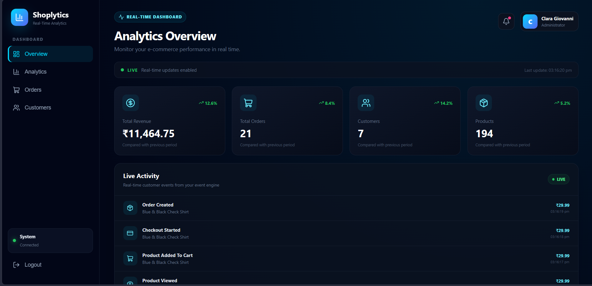
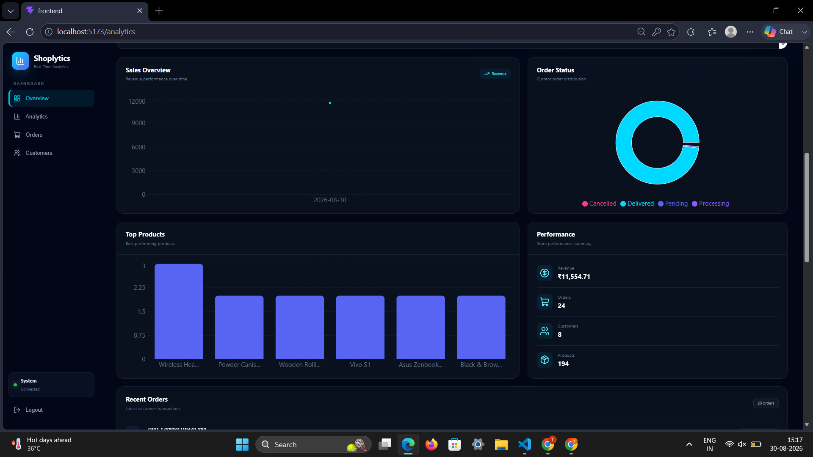
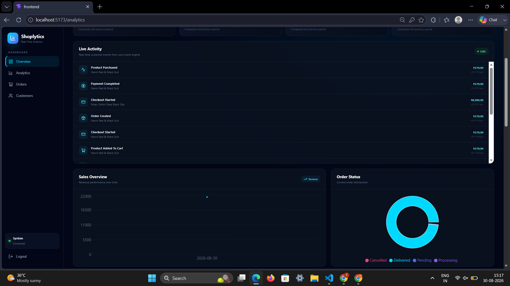

# Real-Time Analytics Dashboard

<h3 align="center">
  A full-stack real-time analytics platform for tracking application activity,
  monitoring events, and visualizing insights through an interactive dashboard.
</h3>

<p align="center">
  REST APIs • MongoDB • Socket.IO • React • Recharts
</p>

<p align="center">


</p>

---

## Overview

**Real-Time Analytics Dashboard** is a full-stack analytics application built using the MERN stack.

The platform collects application events, stores them in MongoDB, processes analytics, and displays the results through an interactive React dashboard.

The main focus of this project is **real-time data communication**. Instead of repeatedly requesting updated information from the backend, the application uses **Socket.IO** to instantly push analytics updates to connected clients.

> **REST APIs handle the data. WebSockets deliver it instantly.**

The project demonstrates how modern web applications can combine:

* REST APIs
* MongoDB
* Express.js
* React
* Socket.IO
* Event-driven architecture
* Real-time data processing
* Data visualization

---

# Features

### Real-Time Analytics

Analytics update instantly whenever a new event is generated.

The dashboard does not require a manual page refresh because updates are delivered through **Socket.IO**.

---

### Document Analytics

Activity can be tracked independently for individual documents.

Each document can have its own collection of events and analytics.

Example:

```text
Document A
 ├── Views
 ├── Opens
 ├── Edits
 └── Downloads
```

---

### Event Tracking

The application supports multiple event types:

```text
VIEW
OPEN
EDIT
DOWNLOAD
```

Each event can contain information such as:

* Document
* User
* Event type
* Metadata
* Timestamp

---

### Live Event Feed

New events appear on the dashboard as soon as they are generated.

Example:

```text
VIEW       user123       Document A
EDIT       user456       Document B
DOWNLOAD   user789       Document C
```

---

### Analytics Overview

The dashboard provides important metrics such as:

* Total Events
* Total Documents
* Total Views
* Total Opens
* Total Edits
* Total Downloads

---

### Interactive Charts

Analytics data is visualized using **Recharts**.

The dashboard can display:

* Event activity
* Event distribution
* Document activity
* Event trends
* Usage statistics

---

### REST API

The backend provides REST endpoints for:

* Documents
* Events
* Analytics

---

### MongoDB Atlas

MongoDB Atlas is used as the cloud database for storing:

* Documents
* Events
* Analytics-related information

---

# Dashboard Preview

The dashboard provides a centralized view of application activity.

It combines analytics cards, charts, document information, and live events in a single interface.

---

# Application Screenshots

## Analytics Dashboard

<p align="center">
  
</p>

The main dashboard provides an overview of application activity and important analytics metrics.

It allows users to quickly monitor the current state of their application.

---

## Analytics Visualization

<p align="center">
  
</p>

Interactive charts provide a visual representation of event activity and document usage.

The visualization makes it easier to identify patterns and understand application activity.

---

## Live Events

<p align="center">
  
</p>

The live event feed displays newly generated events without requiring a page refresh.

This demonstrates the real-time communication capabilities of the application.

---

### Architecture Flow

```text
                    ┌──────────────────┐
                    │      React       │
                    │    Dashboard     │
                    └────────┬─────────┘
                             │
                    REST API │ Socket.IO
                             │
                             ▼
                    ┌──────────────────┐
                    │     Express      │
                    │      Server      │
                    └────────┬─────────┘
                             │
                  ┌──────────┴──────────┐
                  │                     │
                  ▼                     ▼
          ┌──────────────┐      ┌──────────────┐
          │   MongoDB    │      │   Analytics  │
          │     Atlas    │      │   Processing │
          └──────────────┘      └───────┬──────┘
                                        │
                                        ▼
                                  Socket.IO
                                        │
                                        ▼
                              Connected Clients
```

---

# Application Workflow

The application follows this workflow:

```text
User Activity
      │
      ▼
Event Generated
      │
      ▼
Express REST API
      │
      ▼
MongoDB
      │
      ▼
Analytics Processed
      │
      ▼
Socket.IO Broadcast
      │
      ▼
React Dashboard
      │
      ▼
Live Insights
```

This architecture allows the dashboard to continuously display updated information.

---

# Real-Time Data Flow

When a new event is generated, the following process takes place:

```text
1. User performs an action
              │
              ▼
2. Frontend sends event
              │
              ▼
3. Express API receives event
              │
              ▼
4. Event is stored in MongoDB
              │
              ▼
5. Analytics are processed
              │
              ▼
6. Socket.IO broadcasts update
              │
              ▼
7. React receives update
              │
              ▼
8. Dashboard updates instantly
```

This eliminates the need for continuous polling and provides a responsive real-time experience.

---

# Socket.IO Integration

The application uses Socket.IO to broadcast analytics updates to connected clients.

When analytics change, the backend emits an event similar to:

```javascript
io.emit("analyticsUpdated", {
  analytics,
  event
});
```

The React dashboard listens for the `analyticsUpdated` event and updates its state accordingly.

This allows connected clients to receive new information immediately.

---

# Tech Stack

| Technology        | Purpose                             |
| ----------------- | ----------------------------------- |
| **React**         | Frontend dashboard                  |
| **Node.js**       | Backend runtime                     |
| **Express.js**    | REST API                            |
| **MongoDB Atlas** | Cloud database                      |
| **Mongoose**      | MongoDB object modeling             |
| **Socket.IO**     | Real-time communication             |
| **Axios**         | HTTP requests                       |
| **Recharts**      | Data visualization                  |
| **Lucide React**  | Interface icons                     |
| **Vite**          | Frontend development and build tool |

---


# Environment Variables

Create a `.env` file inside the `backend` directory.

```env
PORT=5000
MONGODB_URI=your_mongodb_atlas_connection_string
```

If your application uses additional environment variables, add them here as well.

### Important

Never commit your `.env` file to GitHub.

Add the following to `.gitignore`:

```text
.env
node_modules/
```

---

# Getting Started

## 1. Clone the Repository

```bash
git clone <your-repository-url>
```

## 2. Navigate to the Project

```bash
cd real-time-analytics-dashboard
```

## 3. Install Backend Dependencies

```bash
cd backend
npm install
```

## 4. Install Frontend Dependencies

Open another terminal:

```bash
cd frontend
npm install
```

## 5. Configure MongoDB

Create a MongoDB Atlas database and add your connection string to:

```text
backend/.env
```

Example:

```env
MONGODB_URI=your_connection_string
```

## 6. Start the Backend

```bash
cd backend
npm run dev
```

Backend:

```text
http://localhost:5000
```

## 7. Start the Frontend

Open another terminal:

```bash
cd frontend
npm run dev
```

Frontend:

```text
http://localhost:5173
```

---

# 🧪 Testing the Application

Once both servers are running, the basic flow is:

```text
Frontend
   │
   ▼
Create / Trigger Event
   │
   ▼
Backend API
   │
   ▼
MongoDB
   │
   ▼
Analytics Processing
   │
   ▼
Socket.IO
   │
   ▼
Dashboard
```

You should see the analytics update without refreshing the browser.

---

# Support

If you found this project useful or interesting, consider giving the repository a ⭐ on GitHub.

<p align="center">
  ⚡ <strong>Built for Real-Time. Designed to Scale.</strong>
</p>
